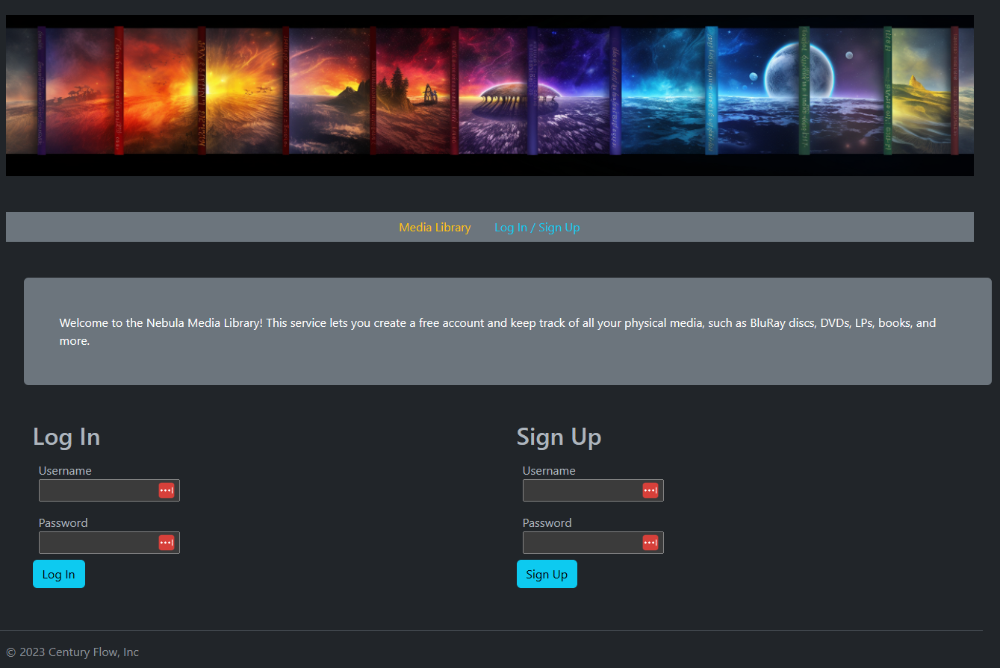
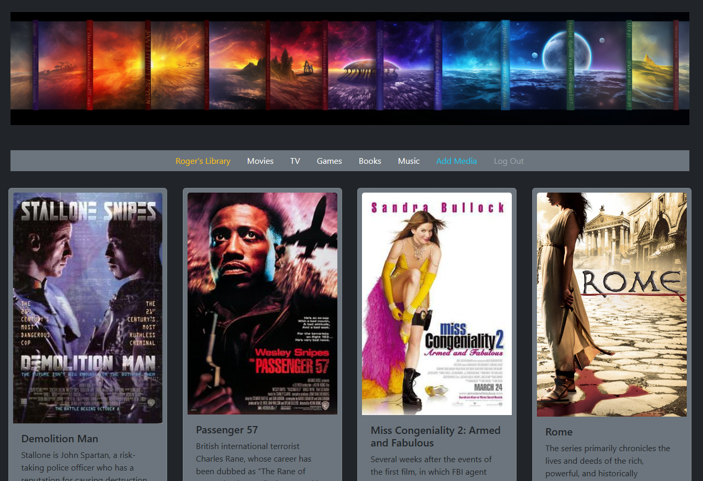

# Nebula Media Library

*An online system to manage your media*

## How to use the Nebula Media Library

To start using Nebula, all you need to do is visit the page and create a free account. Click [here](https://nebula-web-ajfz.onrender.com) to access Nebula!

The home page will ask you to either Sign Up or Log In. If you do not have an account already, complete the Sign Up portion of the screen. If you have already signed up for an account, enter your login credentials and click Log In.

You can then navigate to your media library by clicking the words **Media Library** in the nav bar.

Each user has their own, unique media library. If this is the first time using Nebula, this screen will be blank. Click **Add Media** on the nav bar, complete the fields, and then add your first piece of media. 

You can **Edit** or **Delete** media entries using the corresponding buttons within the media card.

## Purpose ##

The Nebula Media Library is my second project submission. the criteria for the project are as follows - 

* **Must have two SQL tables.** This project has both a users and items SQL table. 
* **Example of CRUD ops.** Authenticated users can add, edit, or delete media. Users can sign up for accounts or log in.
* **Flask implementation**. The project is built in flask.
* **Jinja templates.** There are several.
* **Deployed online.** Project is deployed in render and github.

## Additional Features ##

Unfortunately we only had two evenings for this project, so there are many other features I would have implemented if we were given sufficient time to complete the project.

* More categories
* Responsive categories
* More in depth filters on the libary page
* Transition animations when filtering
* More CSS (I just used Bootstrap for this)
* Implemented Models
* Logical routes (eg when logged in, route to main page)
* User profiles
* etc

## Technologies Used ##

VSCode, Bootstrap, HTML5, PSQL, Flask, Render.com

## Unsolved Problems ##

None within the scope of the project.

## Attribution ##

All CSS done with Bootstrap. Some solutions and workarounds pilfered from internet forums such as stack overflow. Header image from Midjourney.